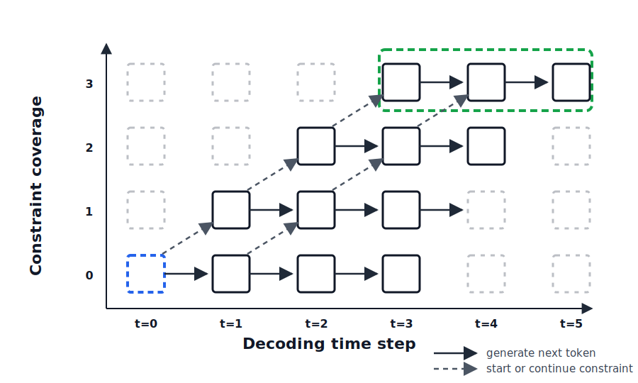

# Nothing Lost in Translation

**Lexically-constrained English→Russian machine translation, built by taking the decoder apart.** This project re-implements Hugging Face's beam search from scratch against the model's raw forward pass, proves the hand-written decoder matches the library on BLEU, and then extends it to do something `.generate()` cannot: **guarantee** that user-specified phrases appear in the translation (or are kept out of it) — with translation quality *rising*, not falling, as constraints are added.

<p align="left">
  
  
  
  
  
</p>

*Grew out of Graduate Assessment 1 (GA1) — NLP 673, University of Maryland Baltimore County. Sole author: **Anupreet Singh**.*

---

## Results at a glance

First 100 sentences of the WMT16 EN→RU validation split, beam width 4, scored with sacreBLEU:

| Decoder | Constraint information used | BLEU |
|---|---|---|
| `model.generate()` (Hugging Face) | none | 24.23 |
| `scratch_beam_search` (this repo, from scratch) | none | **25.45** |
| + Stamping, 4 cycles (oracle ceiling) | phrases **and** their reference positions | 81.70 |
| + **Grid Beam Search**, 4 cycles (deployable) | bare phrases only | **40.59** |

In every constrained run, **100% of forced phrases actually appear in the output** — verified at the token-ID level and in the detokenized text. Grid Beam Search gains **+15 BLEU** over the baseline using only information a real user could supply.

## Try the demo

[](https://colab.research.google.com/github/anupreetsingh/Nothing-Lost-in-Translation/blob/main/DEMO.ipynb)

Type an English sentence, pick Russian phrases that **must** appear (or must **not**), and watch the constrained decoder build a fluent translation around your requirements. That is the whole project in one interactive cell: translation as a *controllable* process instead of a black box.

[DEMO.ipynb](DEMO.ipynb) is a self-contained, three-cell playground built on the same Grid Beam Search decoder as the research notebook — no local setup needed:

1. **Setup** — run once; downloads the ~300 MB MarianMT model (about a minute on a Colab T4).
2. **Input** — your English sentence, required Russian phrases (`CONSTRAINTS`), and blocked phrases (`NEGATIVE_CONSTRAINTS`). Ready-made examples cover medical, legal, and technical terminology, named entities, brand consistency, and content sanitization — see [why these matter](#why-lexical-constraints-matter-in-practice).
3. **Translate** — prints the constrained translation with a per-constraint check: `Present` / `OK` when a requirement or ban was honored. Subsequent translations take ~1–2 seconds.

## Repository layout

```
Nothing-Lost-in-Translation/
├── Final Research Draft.ipynb   # The research notebook: baselines, decoder rebuild,
│                                # constraint mining, stamping, Grid Beam Search,
│                                # negative constraints
├── DEMO.ipynb                   # Interactive demo: your sentence, your required /
│                                # blocked Russian phrases (Colab-ready)
├── assets/
│   └── grid-beam-search.svg     # Grid Beam Search diagram used in this README
└── GA1 Submission/
    ├── GA1.ipynb                # Original coursework notebook (historical record)
    └── GA1.pdf                  # Original written report
```

---

## Table of contents

- [The problem](#the-problem)
- [Background: from greedy decoding to beam search](#background-from-greedy-decoding-to-beam-search)
- [The journey, end to end](#the-journey-end-to-end)
  - [1. Data and model selection](#1-data-and-model-selection)
  - [2. A baseline to beat](#2-a-baseline-to-beat)
  - [3. The tokenizer detail that decides everything](#3-the-tokenizer-detail-that-decides-everything)
  - [4. Rebuilding beam search from scratch](#4-rebuilding-beam-search-from-scratch)
  - [5. Mining constraints: the pick–revise loop](#5-mining-constraints-the-pickrevise-loop)
  - [6. Track A — Stamping, the oracle ceiling](#6-track-a--stamping-the-oracle-ceiling)
  - [7. Track B — Grid Beam Search, the deployable method](#7-track-b--grid-beam-search-the-deployable-method)
  - [8. Negative constraints: keeping phrases out](#8-negative-constraints-keeping-phrases-out)
- [Results in detail](#results-in-detail)
- [Why lexical constraints matter in practice](#why-lexical-constraints-matter-in-practice)
- [Running the research notebook](#running-the-research-notebook)
- [Tech stack](#tech-stack)
- [Limitations and future work](#limitations-and-future-work)
- [Author and references](#author-and-references)

---

## The problem

A translation model's decoder is usually a black box: you call `.generate()` and trust whatever beam search hands back. Most of the time that is fine. But real translation work often comes with *hard requirements* — a medical term that must not be paraphrased, a product name that must stay in its official form, a glossary the output must comply with, a word the style guide bans. Plain beam search offers no lever for any of this: an output can be fluent and high-probability while still dropping the one phrase that mattered.

This project builds that lever. The path runs from the model's raw forward pass, through a from-scratch beam search verified against the library, to two constrained decoders — one that cheats to establish the ceiling, and one, Grid Beam Search ([Hokamp & Liu, 2017](https://arxiv.org/abs/1704.07138)), that could actually ship.

## Background: from greedy decoding to beam search

A sequence-to-sequence model does not emit a translation in one go. The source sentence flows through the encoder once; the decoder then builds the output token by token, and at each step the model scores every vocabulary token as a possible continuation. The *decoding algorithm* decides which partial translations live on.

- **Greedy decoding** keeps exactly one candidate: take the top-scoring token at each step and never look back. Fast, but a locally best token is not always part of the best complete sentence — good paths get discarded before they can pay off.
- **Exhaustive search** would score every possible sequence: `|V|^T` candidates for vocabulary size `|V|` and length `T`. At 50,000 tokens and 20 steps that is `50,000^20` sequences — never practical.
- **Beam search** is the working compromise: keep the top `k` partial hypotheses after every step, expanding roughly `T × k × |V|` candidates in total. It recovers from locally imperfect choices without attempting the impossible.

Beam search is what `.generate()` runs under the hood. But it still has no notion of *requirements*: nothing in its scoring protects a low-probability-but-mandatory phrase from being pruned, and nothing bans an unwanted one. Adding those controls means owning the loop — which is where this project starts.

## The journey, end to end

The full narrative, with code and annotated commentary, lives in [Final Research Draft.ipynb](Final%20Research%20Draft.ipynb). This is the map.

### 1. Data and model selection

The dataset is [WMT16](https://huggingface.co/datasets/wmt/wmt16) EN→RU: ~1.5M training pairs and 2,998 validation pairs, loaded via `datasets`.

The first modeling attempt was fine-tuning `google/mt5-base` — a multilingual model that is not a translator out of the box. After hours of training it still trailed a purpose-built translation model, and the redirect was cheap: everything this project investigates concerns *decoding*, not the model producing the logits. The winner was **`Helsinki-NLP/opus-mt-en-ru` (MarianMT)** — small (~300 MB), purpose-built for the pair, strong with no training at all. The mt5 pipeline stays in the notebook behind a flag as a documented dead end.

### 2. A baseline to beat

Before replacing the decoder, establish the number it must reproduce: the library's own beam search (`model.generate()`, 4 beams) on the first 100 validation sentences scores **BLEU 24.23** under sacreBLEU. Every later experiment is read as a delta from this run.

### 3. The tokenizer detail that decides everything

`MarianTokenizer` bundles **two** SentencePiece models: `source.spm` (English) and `target.spm` (Russian). A bare `tokenizer(...)` call always segments with the *source* one. Segment Russian text that way and you get character shrapnel or `<unk>` pieces — token sequences the decoder never actually produces.

This silently broke the project's first constrained-decoding implementation: references, mined phrases, and hypotheses were all encoded with the English segmenter, so every constraint pushed into the decoder was expressed in a vocabulary it never emits. Constraints never landed, the same phrase was re-mined cycle after cycle, and BLEU *fell* when constraints were applied. The fix is one rule enforced everywhere — **every target-side string goes through `encode_target()`**, which routes text through the target SentencePiece model — plus a sanity-check cell that prints both segmentations side by side so the difference can never go invisible again. This was the project's key debugging finding.

### 4. Rebuilding beam search from scratch

`scratch_beam_search` replaces `.generate()` by driving the model's raw forward pass one token at a time. The flow of a decode:

1. **Fan out the input.** Each source sentence's `input_ids` and `attention_mask` are expanded with `repeat_interleave(num_beams)`, one row per hypothesis, all attached to the same source. `decoder_input_ids` starts as one `decoder_start_token_id` per hypothesis.
2. **Seed the beams.** A forward pass returns logits — raw scores over the vocabulary for the next position. `log_softmax` converts them to log-probabilities that can be summed across steps without underflow. Since every hypothesis starts identically, the first expansion simply takes the sentence's top `num_beams` tokens as the initial beam.
3. **Expand.** At each later step, every surviving hypothesis proposes its top `num_beams` continuations, each continuation's log-probability added to the hypothesis's running score — `num_beams × num_beams` candidates per source sentence.
4. **Select and bookkeep.** Candidates compete only against candidates from the same source sentence; the best `num_beams` survive, each mapped back to the hypothesis it extends. Finished beams are frozen — extended with pad at zero cost — so nothing is generated past EOS.
5. **Terminate.** The loop stops at `max_length`, or earlier with `early_stopping` when the best new token is EOS. The top beam per sentence is decoded back to text.

(Model anatomy worth knowing when reading the code: for the Helsinki model `eos = 0`, `unk = 1`, and `pad = decoder_start = 62517` — the pad ID doubles as the decoder's start token.)

The point is trust, then surgery: the scratch decoder scores **BLEU 25.45**, faithfully reproducing (here slightly exceeding) the library's 24.23 — which makes it a safe foundation. Both constrained decoders below start from this exact loop.

### 5. Mining constraints: the pick–revise loop

With a trustworthy decoder, the experimental question becomes: can we *guarantee* that specific reference phrases appear in the translation? The workflow is **pick–revise**: compare the current translation against the reference → *pick* the longest reference n-gram (up to 3 words) missing from it → make that phrase a hard constraint → *revise* by re-decoding with all constraints accumulated so far → repeat for `CYCLES` rounds, one new constraint per sentence per round.

The mining functions (`mine_word` by default, `mine_token` as an alternative granularity) encode three rules, each of which exists because its absence was a real failure mode in the first implementation:

- **Longest-first (3-gram → 2-gram → 1-gram)** — a longer contiguous phrase carries more information per constraint.
- **Span tracking** — reference spans already used in earlier cycles are skipped; without this, overlapping constraints get re-mined and force duplicated text into the output.
- **Target-side tokenization** — every mined Russian phrase goes through `encode_target()` (see [above](#3-the-tokenizer-detail-that-decides-everything)).

Mining returns each phrase's token IDs *and* its position in the reference. Only stamping consumes the position; Grid Beam Search deliberately ignores it — that distinction is the whole experiment.

### 6. Track A — Stamping, the oracle ceiling

`stamping_beam_search` is the scratch decoder with a constraint schedule grafted on: constraints enter as a queue sorted by reference position → a constraint becomes due once decoding reaches that position and emits one token per step → each forced token is still scored under the model, keeping beam scores comparable → EOS stays masked while anything is pending, so a sentence cannot end before its constraints are placed.

Its BLEU climbs to 81.70 in four cycles — and that is precisely its flaw. The placement position is **oracle information**: it exists only because the reference translation is sitting there to copy from. In every real use — glossary enforcement, protecting a product name, interactive post-editing — the user knows *which* phrase must appear, never *where* it belongs in a sentence that has not been generated yet. Stamping is kept as a learning exercise and as the upper bound: the score you reach when placement comes for free.

### 7. Track B — Grid Beam Search, the deployable method

`grid_beam_search` implements Hokamp & Liu (2017). The search lives on a grid indexed by *(timestep, coverage)*, where coverage is the number of constraint tokens emitted so far:



The horizontal axis is the normal decoding timeline; the vertical axis is constraint progress. Each cell holds its own beam of up to `k` hypotheses that share a timestep and a coverage level. The flow of one step: all live hypotheses across every coverage level are batched through the decoder in **one forward pass** (the encoder ran exactly once up front; its states are re-used every step) → every hypothesis expands three ways, each scored by the model —

- **generate** a free token from the vocabulary (a horizontal move: same coverage),
- **start** the first token of a not-yet-covered constraint (a diagonal move: coverage + 1),
- **continue** the currently open constraint (diagonal: coverage + 1)

— → successors are re-bucketed by coverage, and the top-`num_beams` *distinct* hypotheses per level survive.

The bucketing is the insight: hypotheses are pruned by score only *within their own coverage level*, never against hypotheses that have made different constraint progress. That is what protects an improbable-but-required phrase from being pruned mid-emission — the exact failure plain beam search cannot avoid. Two guards keep the search honest: a hypothesis is dropped once it can no longer cover the remaining constraint tokens in the steps left, and EOS is masked until coverage is complete. The winner is the best length-normalized finished hypothesis that has covered **all** constraints.

The cost: with `c` constraint-coverage states, roughly `T × c × k × |V|` expansions instead of beam search's `T × k × |V|` — more expensive, still nowhere near exhaustive search's `|V|^T`. The property that matters: constraints enter as **bare phrases** — no positions anywhere in the interface. Exactly the information a real user could supply.

### 8. Negative constraints: keeping phrases out

The mirror question arrives immediately in any real use: how do we keep a phrase *out*? Profanity that should give way to a euphemism, a competitor's name, an anglicism the style guide forbids.

The same decoder accepts `negative_constraints`, and the mechanism needs no new grid dimension — the coverage grid exists to *protect* improbable-but-required progress, whereas a ban only removes options. So it is masking inside the existing loop: a banned phrase goes through `encode_target()` into token-ID sequences → at every **generate** expansion, any token that would *complete* a banned sequence given the hypothesis's current tail is masked to `-inf` before the top-k → the probability mass falls to the runner-up, which for a harsh word is usually a milder synonym → forced positive tokens are guarded the same way, so a required phrase can never smuggle a banned one in.

Negative constraints sit outside the BLEU experiments by design: pick–revise mines phrases to *require* from the reference, and a reference offers nothing to *ban*. Section 8 of the notebook demonstrates them the way they would actually be used — ban the anglicism «Мистер», let the decoder fall back to its next-best honorific, optionally pair the ban with a positive constraint («Господин Моди») to *direct* the replacement instead of trusting the model's ranking, and assert at the token level that the banned sequence is truly absent. Two honest caveats: the match is exact, so each surface form (case, inflection) needs its own blocklist entry; and banning selects *against* a phrase, never *for* its replacement — composition with a positive constraint is the fix.

## Results in detail

First 100 sentences of the WMT16 EN→RU validation split, `NUM_BEAMS = 4`, word-level mining, 4 pick–revise cycles, scored with sacreBLEU. Both tracks start from the custom decoder's 25.45 baseline; each cycle mines one new missing reference phrase per sentence from that track's own previous output and re-decodes with all constraints so far:

| Cycle | Stamping BLEU | GBS BLEU | Constraints satisfied (both tracks) |
|-------|---------------|----------|-------------------------------------|
| baseline | 25.45 | 25.45 | — |
| 1 | 38.68 | 31.81 | 100% |
| 2 | 56.20 | 38.41 | 100% |
| 3 | 71.95 | 40.40 | 100% |
| 4 | **81.70** | **40.59** | 100% |

(Constraints mined per cycle fall from 99 sentences in cycle 1 to ~60 by cycle 4, as translations progressively recover the reference.)

How to read the two curves:

- **Constraints actually land.** In every cycle of both tracks, 100% of forced phrases appear in the output, verified both at the token-ID level and in the detokenized text. The project's first, bugged implementation could not achieve this — see [the tokenizer section](#3-the-tokenizer-detail-that-decides-everything).
- **Both curves rise** — adding hard constraints *improves* translation quality rather than trading it away.
- **Stamping's curve is a ceiling, not a victory.** It consumes oracle positions copied from the reference, so its BLEU measures how much reference information was injected — not quality any user could obtain.
- **GBS's curve is the honest one.** It rises from 25.45 to 40.59 (**+15 BLEU**) using only the phrases themselves, while the model keeps their placement fluent. The gap between the curves is the price of not cheating.

A constraint visibly landing (cycle 1, GBS). Forcing «Господин Моди находится» ("Mr. Modi is [currently]") makes the decoder restructure the whole sentence around the required honorific:

> **before:** Мистер Моди в пятидневной поездке в Японию для укрепления экономических связей…
> **after:** Господин Моди находится в пятидневной поездке в Японию, чтобы укрепить экономические связи…

**Cost.** Stamping runs at roughly the speed of unconstrained search (~0.4 s/sentence on a Colab T4). GBS grows with accumulated constraints — from ~1.9 s/sentence in cycle 1 to ~5.2 s in cycle 4 — because it maintains a beam per coverage level. GBS outputs also lengthen across cycles (mean ~32 → ~49 tokens), partly legitimate recovery of reference content, partly verbosity worth auditing.

## Why lexical constraints matter in practice

Constrained decoding turns translation from "hope the model preserves it" into "the decoder must include it." Concrete uses, each demonstrated in the [demo notebook](DEMO.ipynb):

- **Domain-specific jargon (legal, medical, technical)** — preserve terms whose mistranslation changes meaning or creates safety issues. Translating *"The patient presented with bilateral lower extremity edema and dyspnea…"*, requiring «двусторонний отек нижних конечностей» and «одышка» keeps the clinical terms where an unconstrained model may simplify them to "swelling of both legs" and "difficulty breathing".
- **Named entities** — pin people and places to one standard transliteration. Requiring «Джасинда Ардерн» and «Веллингтон» prevents variant spellings like «Ясинда Ардерн» or «Уэллингтон».
- **Brand and product consistency** — requiring "Apple" and "Vision Pro" keeps brand names in their official Latin-script form instead of transliterations («Эппл» / «Вижн Про») — or the literal «Яблоко», the fruit.
- **Glossary compliance** — requiring the approved fintech term «чарджбэк» (chargeback) stops the model substituting a generic paraphrase like «возврат платежа» (payment refund).
- **Content sanitization** — the negative direction: blocking «тупой» (stupid) and «бесполезный» (useless) makes the decoder fall back on milder wording such as «неудачный» or «неэффективный».

## Running the research notebook

The demo needs nothing but the [Colab link](#try-the-demo). To reproduce the experiments, open [Final Research Draft.ipynb](Final%20Research%20Draft.ipynb) locally (create a virtual environment and select it as the kernel — Section 0 of the notebook walks through it) or upload it to Colab, then run the cells top to bottom: the first cell installs every dependency, the device (CUDA / Apple Silicon MPS / CPU) is auto-detected, and the WMT16 data downloads itself. Nothing needs editing to run.

The experiment's scale is set by one configuration cell near the top:

| Knob | Default | Effect |
|------|---------|--------|
| `N_EVAL` | 100 | Evaluation sentences; raise for more stable BLEU, lower for speed |
| `CYCLES` | 4 | Pick–revise rounds (one new constraint per sentence per round) |
| `NUM_BEAMS` | 4 | Beam width; Hokamp & Liu used 10 |
| `MINE_MODE` | `"word"` | Mining granularity: whitespace words or raw token IDs |

## Tech stack

| Component | Choice |
| --- | --- |
| Translation model | `Helsinki-NLP/opus-mt-en-ru` (MarianMT, 6+6 layers, d=512, vocab 62,518) |
| ML framework | PyTorch + Hugging Face `transformers` / `accelerate` |
| Data | WMT16 `ru-en` via `datasets` |
| Evaluation | `sacrebleu` |
| Tokenization | `sentencepiece` — separate source/target models; all target text via `encode_target()` |
| Historical | `google/mt5-base` fine-tuning attempt, preserved behind a flag |

## Limitations and future work

- **Constraints are mined from gold references** — the research loop answers "does constrained decoding work?", not a deployment scenario. [DEMO.ipynb](DEMO.ipynb) closes part of the gap by taking user-supplied phrases; a glossary-driven pipeline is the natural next step.
- **GBS is slow, and slows as constraints accumulate** — ~1.9 s/sentence with one constraint rising to ~5.2 s with four. Batching multiple sentences through GBS at once is unimplemented.
- **Outputs lengthen under GBS** — mean length grows ~32 → ~49 tokens across four cycles; some is legitimate recovery of reference content, some may be verbosity worth auditing.
- **Modest evaluation scale** — 100 sentences, 4 beams (the paper used 10); both are single-knob changes (`N_EVAL`, `NUM_BEAMS`) trading runtime for fidelity.
- **Exact-match negative constraints** — each surface form (case, inflection) of a banned word needs its own entry; production use would expand lemmas or add a detokenized substring check.
- **Single language pair** — only EN→RU is evaluated; the decoders themselves are language-agnostic.

## Author and references

**Anupreet Singh** — sole author. Designed and built the project end to end: the from-scratch decoder verified against `.generate()` (25.45 vs 24.23 BLEU), both constrained decoders (stamping and Grid Beam Search with coverage-bucketed beams, feasibility pruning, and length-normalized selection — 25.45 → 40.59 BLEU at 100% constraint satisfaction), the negative-constraint extension, the pick–revise mining loop, the diagnosis of the dual-SentencePiece tokenizer bug, the WMT16 evaluation pipeline, the mt5 comparison, the interactive demo, and the annotated write-up.

**Reference:** Chris Hokamp and Qun Liu. 2017. [*Lexically Constrained Decoding for Sequence Generation Using Grid Beam Search*](https://arxiv.org/abs/1704.07138). ACL 2017.
